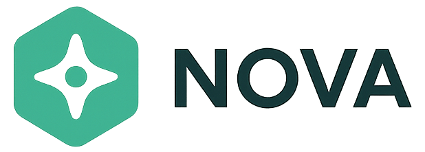

# NOVA - KI-gestützte Datenschutz-Compliance-Plattform

NOVA ist eine webbasierte Softwarelösung für intelligentes Datenschutz- und Compliance-Management. Die Plattform nutzt künstliche Intelligenz, um Unternehmen bei der Einhaltung von Datenschutzanforderungen (DSGVO, AI Act) zu unterstützen.



## 🎯 Features

### Compliance & Regulierung
- **AI Act Readiness Wizard** - Multi-Step-Analyse zur Bewertung der AI Act Compliance
- **AVV-Prüfung** - Automatisierte Prüfung von Auftragsverarbeitungsverträgen
- **Risikoanalysen** - KI-gestützte Bewertung von Datenschutzrisiken
- **Vorfall-Management** - Strukturierte Erfassung und Bewertung von Datenschutzvorfällen

### Intelligente Assistenz
- **NOMI Chat-Assistent** - KI-basierter Chatbot für Datenschutzfragen
- **Automatische Berichte** - PDF/JSON-Export von Compliance-Reports
- **Smart Analytics** - Dashboard mit Echtzeit-Compliance-Metriken

### Management & Schulung
- **Projektmanagement** - Zentrale Verwaltung von Datenschutz-Projekten
- **Schulungsmodule** - Interaktive Datenschutz-Trainings mit Zertifikaten
- **Kundenprofil** - Personalisierte Compliance-Übersicht

## 🚀 Technologie-Stack

- **Frontend**: React 19 + TypeScript
- **Build Tool**: Vite 7
- **Routing**: React Router DOM 7
- **Auth & Database**: Firebase (Authentication + Firestore)
- **UI/UX**: Framer Motion, React Calendar
- **PDF-Verarbeitung**: jsPDF, PDF.js
- **Styling**: CSS Custom Properties (Design System)

## 📦 Installation & Setup

### Voraussetzungen
- Node.js 18+ und npm
- Firebase-Projekt mit Authentication und Firestore

### 1. Repository klonen
```bash
git clone <repository-url>
cd ai-act-wizard
```

### 2. Dependencies installieren
```bash
npm install
```

### 3. Environment Variables konfigurieren
Erstelle eine `.env` Datei im Root-Verzeichnis (siehe `.env.example`):

```env
VITE_FIREBASE_API_KEY=your_api_key
VITE_FIREBASE_AUTH_DOMAIN=your_project.firebaseapp.com
VITE_FIREBASE_PROJECT_ID=your_project_id
VITE_FIREBASE_STORAGE_BUCKET=your_project.firebasestorage.app
VITE_FIREBASE_MESSAGING_SENDER_ID=your_sender_id
VITE_FIREBASE_APP_ID=your_app_id

VITE_API_BASE_URL=/api
VITE_AI_PROVIDER=claude
VITE_AI_MODEL=claude-3-5-sonnet-20241022
VITE_LOG_ENDPOINT=
VITE_MONITORING_ENABLED=false

AI_SERVER_PORT=5174
ANTHROPIC_API_KEY=your_anthropic_api_key
ANTHROPIC_MODEL=claude-3-5-sonnet-20241022
```

**⚠️ Sicherheit**: Die `.env` Datei enthält sensible Daten und wird nicht in Git committed!

### 4. Development Server starten
```bash
npm run dev
```

Die Anwendung läuft auf `http://localhost:5173`

## 🛠️ Verfügbare Scripts

| Befehl | Beschreibung |
|--------|-------------|
| `npm run dev` | Startet den Development Server mit Hot Module Replacement |
| `npm run build` | Erstellt Production Build (TypeScript Type-Check + Vite Build) |
| `npm run preview` | Preview der Production Build lokal |
| `npm run lint` | Führt ESLint aus (JavaScript + TypeScript) |
| `npm run type-check` | TypeScript Type-Checking ohne Build |
| `npm run dev:api` | Startet den AI-Proxy Server |
| `npm run test:e2e` | Playwright E2E Tests |

## 📁 Projekt-Struktur

```
ai-act-wizard/
├── public/                     # Statische Assets
│   ├── style.css              # Globales NOVA Design System
│   └── bilder/                # Logos und Bilder
├── src/
│   ├── components/
│   │   ├── common/            # Wiederverwendbare Components (Navbar, Sidebar, Toast)
│   │   ├── layout/            # Layout-Components
│   │   └── ui/                # UI-Primitives
│   ├── features/              # Feature-Module
│   │   ├── compliance/        # AI Act Wizard, AVV-Check
│   │   ├── dashboard/         # Haupt-Dashboard
│   │   ├── incidents/         # Vorfall-Management
│   │   ├── projects/          # Projekt-Verwaltung
│   │   ├── risk-analysis/     # Risikoanalysen
│   │   ├── training/          # Schulungsmodule
│   │   └── ...
│   ├── auth/                  # Authentication (Firebase Auth Context)
│   ├── lib/                   # Utilities (AI Act Scoring, Exporters)
│   ├── nomi/                  # KI Chat-Assistent
│   ├── hooks/                 # Custom React Hooks
│   ├── styles/                # Design System (tokens.ts, nova-design-system.css)
│   ├── types/                 # TypeScript Type Definitions
│   ├── App.tsx                # Haupt-App-Component mit Routing
│   ├── main.tsx               # Einstiegspunkt
│   └── vite-env.d.ts          # TypeScript Environment Declarations
├── .env                       # Environment Variables (nicht in Git!)
├── .env.example               # Template für Environment Variables
├── tsconfig.json              # TypeScript Konfiguration
├── vite.config.ts             # Vite Build-Konfiguration
└── package.json               # Dependencies & Scripts
```

## 🔐 Sicherheit

- **Environment Variables**: Alle sensiblen Firebase-Credentials sind in `.env` ausgelagert
- **Firebase Rules**: Firestore Security Rules für Datenzugriff konfigurieren
- **Authentication**: Firebase Email/Password Authentication
- **Protected Routes**: Nur authentifizierte User haben Zugriff auf geschützte Bereiche

## 🎨 Design System — Glassmorphism + Neon Glow

NOVA verwendet ein eigenes Design System basierend auf **Glassmorphism** und **Neon-Glow-Akzenten**.

### Dateien

| Datei | Beschreibung |
|---|---|
| `src/styles/tokens.ts` | TypeScript Design-Tokens (Farben, Radien, Schatten, Abstände) |
| `src/styles/nova-design-system.css` | ~480 Zeilen CSS mit allen Utility-Klassen |
| `src/components/ui/GlassCard.tsx` | Wiederverwendbare GlassCard-Komponente |
| `src/hooks/useScrollReveal.tsx` | Scroll-basierte Reveal-Animationen |

### Zentrale CSS-Klassen

| Klasse | Zweck |
|---|---|
| `.nova-glass-static` | Glasmorphe Karte (backdrop-blur, rgba-Fläche, Gradient-Border) |
| `.nova-btn` / `.nova-btn-outline` | Primärer / Outline-Button mit Hover-Glow |
| `.nova-input` | Input-Feld mit Glas-Hintergrund und Fokus-Glow |
| `.nova-badge` | Status-Badges (success, warning, danger, info) |
| `.nova-reveal` | Scroll-Reveal-Animation (via `useScrollReveal`) |
| `[data-tooltip]` | Pure-CSS Tooltips (kein JS nötig) |

### Design-Tokens (Auszug)

```ts
colors.primary    = '#22d3ee'   // Cyan
colors.accent     = '#a78bfa'   // Violett
colors.success    = '#34d399'   // Grün
colors.surface    = 'rgba(255,255,255,0.06)'
colors.text       = '#f0fdfa'
radius.lg         = '1rem'
radius.xl         = '1.25rem'
```

## 🔄 Workflow

1. **Login/Registrierung** via Firebase Authentication
2. **Welcome Page** mit persönlichem Compliance-Status
3. **Dashboard** mit Übersicht und Quick Actions
4. **Feature-Module** für spezifische Aufgaben (AI Act, Vorfälle, Schulungen)
5. **Berichte & Exports** für Dokumentation

## 🤖 KI-Integration

Die Plattform nutzt KI für:
- **Compliance-Bewertung**: Intelligente Analyse von AI-Systemen nach AI Act
- **Vorfall-Severity-Assessment**: Automatische Einstufung von Datenschutzvorfällen
- **AVV-Analyse**: Intelligente Verarbeitung von Verträgen
- **Chat-Assistent (NOMI)**: Kontextuelle Hilfe bei Datenschutzfragen

Prompt-Definitionen befinden sich in `src/nomi/prompts/`

## 📊 Firebase Struktur

### Authentication
- Email/Password Authentication
- User Management via AuthContext

### Firestore Collections
- `users` - Benutzerdaten und Profile
- `appointments` - Terminbuchungen (Live-Demo, Beratungsgespräche)
- *(weitere Collections nach Bedarf)*

## 🚧 Roadmap

- [ ] Testing (Vitest + React Testing Library)
- [ ] CI/CD Pipeline (GitHub Actions)
- [ ] PWA Support (Offline-Modus)
- [ ] Dark Mode
- [ ] Excel-Export für Berichte
- [ ] E2E Tests (Playwright)
- [ ] Performance-Optimierungen (Code Splitting, Lazy Loading)

## 🤝 Entwicklung

### TypeScript
Das Projekt nutzt TypeScript mit Strict Mode. Bestehende JavaScript-Files werden graduell migriert.

### Code Quality
- ESLint für JavaScript und TypeScript
- React Hooks Rules
- Type-Checking bei jedem Build

### Git Workflow
1. Feature Branch erstellen
2. Änderungen committen
3. Pull Request erstellen
4. Nach Review: Merge in `main`

---

## 📋 Changelog

### v2.0.0 — Glassmorphism UI Redesign (Juni 2025)

**Design System neu aufgebaut:**
- `src/styles/tokens.ts` — TypeScript Design-Tokens (Farben, Radien, Schatten, Abstände)
- `src/styles/nova-design-system.css` — ~480 Zeilen CSS (Glassmorphism-Karten, Buttons, Inputs, Badges, Tooltips, Animationen)
- `src/components/ui/GlassCard.tsx` — Wiederverwendbare Glasmorphe Karte
- `src/hooks/useScrollReveal.tsx` — Scroll-basierte Reveal-Animationen

**Alle Seiten & Komponenten migriert (30+ Dateien):**
- Layout: Sidebar, Navbar, Footer, App.tsx
- Auth: Login, ProtectedRoute
- Kern-Seiten: Dashboard, WelcomePage, Landing
- AVV-Wizard: 7 Wizard-Steps (Upload → Preview → Analyzing → Result → Export)
- Compliance: AvvCaseList, AvvCheck, AvvReport, AiActWizard
- Features: IncidentReport/Result, CustomerProfile, Verarbeitungstätigkeiten, Einstellungen, Berichte, Risikoanalysen, Projekte, Training, ApprovalQueue, ReviewPanel
- Öffentlich: LiveDemo, Demoanfordern, GespraechVereinbaren, News, LandingNavbar
- Shared: Skeleton, ErrorBoundary, AIPoweredBadge

**Patterns eingeführt:**
- `nova-glass-static` statt `.card` / `.bg-white`
- `nova-btn` / `nova-btn-outline` statt `.button` / Tailwind-Buttons
- `nova-input` statt individueller Input-Styling
- `data-tooltip="…"` statt `InfoTooltip`-Komponente + `onMouseEnter/Leave`
- `tokens.*` Import für alle inline-Styles

**Qualität:**
- TypeScript `tsc --noEmit` validiert
- Vite Production Build erfolgreich
- Keine alten `.card`/`.button` Klassen mehr in TSX-Dateien

### v1.0.0 — AVV-First DSGVO-Plattform

- Initiale Plattform mit React 19 + TypeScript + Vite 7 + Firebase
- 5-Schritt AVV-Wizard mit Persistenz (Firestore)
- KI-Integration (Anthropic Claude) für Compliance-Bewertung, Vorfall-Assessment, AVV-Analyse
- Feature-Module: Dashboard, Vorfälle, AI Act Wizard, Schulungen, Projekte, Risikoanalysen
- Firebase Authentication + Protected Routes
- Chat-Assistent NOMI

---

## 📝 Lizenz

Proprietär - Yusuf Öztürk

## 👥 Kontakt

Bei Fragen oder Problemen wenden Sie sich an das NOVA-Entwicklerteam.

---

**Version**: 0.0.0  
**Stand**: Februar 2026
